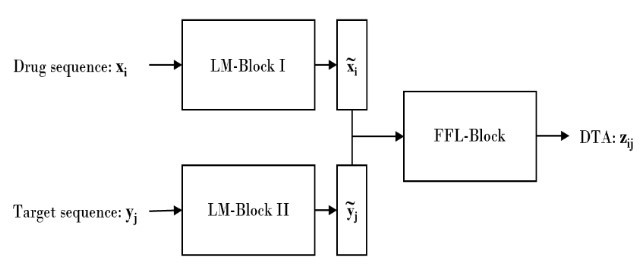

<h1 align="center">LM-DTA</h1>

  <b>Language models for drug–target affinity.</b> 
  Read a drug and a target as sequences; predict how strongly they bind.

<a href="https://flurinh.github.io/aboutme">◆ Portfolio</a>

<i>You may also be interested in</i>

<table align="center"><tr>
<td align="left">←&nbsp; <b>Previous work</b> <a href="https://flurinh.github.io/aboutme/#bachelor">First steps — EEG & brain–computer interfaces</a></td>
<td width="56"></td>
<td align="right"><b>Continuation of this project</b> &nbsp;→ <a href="https://github.com/flurinh/mt">Master thesis — proteins as graphs</a></td>
</tr></table>

---

## What it is

A research project in the **Computer-Assisted Drug Design (CADD) lab** (Prof. G. Schneider;
supervised by Dr. F. Grisoni & M. Moret). LM-DTA treats both the **drug** and the **target**
as sequences and learns deep representations of each with **LSTM language-model blocks**,
combining them in a feed-forward block to predict drug–target affinity (DTA).

Using **transfer learning** to alleviate the scarce-data problem, the optimized LM-DTA model
**outperformed the baseline and the state of the art on the KIBA dataset**.

📄 **[Read the full report (PDF)](LM_DTA.pdf)**

## Reproduce

To rerun the experiments with the original data, get in touch: **hidberf@gmail.com**.

## How it fits

My first deep-learning research on biomolecules — sequences in, a property out. The next step
traded sequences for **graphs**: the [master thesis](https://github.com/flurinh/mt) on GPCRs,
which in turn grew into [ProtOS](https://github.com/flurinh/protos).

